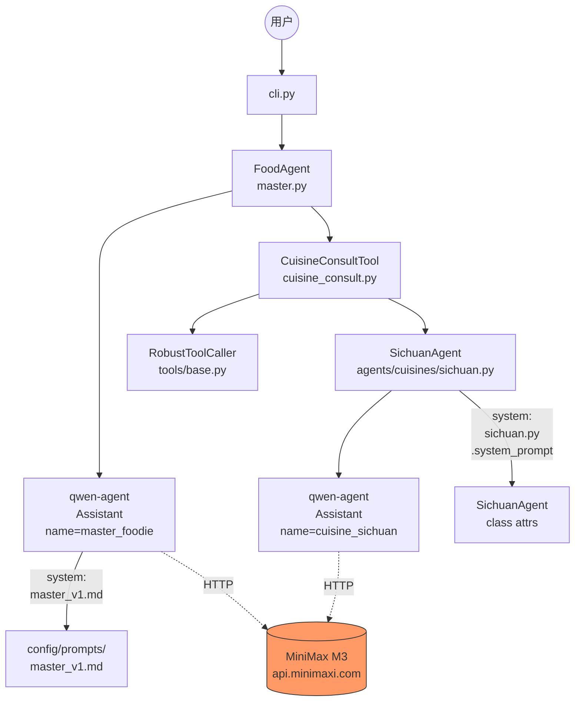
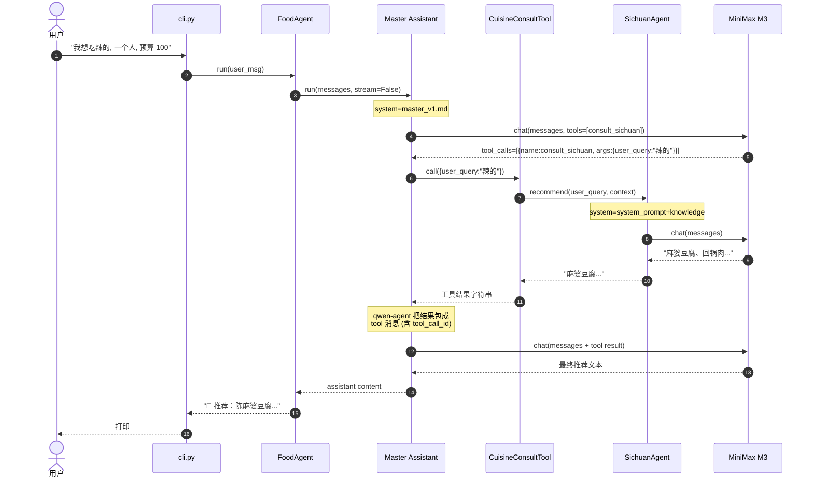

# 04 - 当前实现架构图

> 与 `02-architecture.md`（未来设计）配套。本文聚焦 **当前已落地的代码** 怎么连、
> 提示词在哪个文件、配置从哪来。

## 1. 一句话总览

```
CLI 输入 ─→ FoodAgent(master) ─→ qwen-agent Assistant ─→ MiniMax M3
                       │
                       └─→ CuisineConsultTool(每个菜系一个)
                                     │
                                     └─→ BaseCuisineAgent (qwen-agent Assistant)
                                                   │
                                                   └─→ MiniMax M3 (子 Agent 的 prompt)
```

**所有 LLM 调用都走 MiniMax M3**，分两层：
- Master Foodie (`master_v1.md` 提示词) — 调度
- Cuisine 子 Agent (`sichuan_v1.md` 等) — 回答专业问题

---

## 2. 分层架构（已落地部分）

```
┌──────────────────────────────────────────────────────────────────┐
│  入口层 (Entry)                                                  │
│    src/food_agent/__main__.py   ── python -m food_agent 入口      │
│    src/food_agent/cli.py        ── CLI / REPL                    │
│    src/food_agent/web.py        ── Gradio UI (目前 stub)         │
└──────────────────────────────────────────────────────────────────┘
                              │
                              ▼
┌──────────────────────────────────────────────────────────────────┐
│  调度层 (Orchestration)                                          │
│    src/food_agent/master.py     ── FoodAgent 类, 持有 Assistant  │
│    src/food_agent/llm.py        ── LLM 配置 + qwen-agent patch   │
│    src/food_agent/registry.py   ── 动态加载 (Phase 2 接入点)      │
└──────────────────────────────────────────────────────────────────┘
                              │
                              ▼
┌──────────────────────────────────────────────────────────────────┐
│  工具层 (Tools)                                                  │
│    src/food_agent/tools/base.py         ── RobustToolCaller       │
│                              (重试/熔断/降级)                    │
│    src/food_agent/tools/cuisine_consult.py                        │
│                              ── CuisineConsultTool              │
│                              (把菜系 Agent 包成 OpenAI Tool)     │
└──────────────────────────────────────────────────────────────────┘
                              │
                              ▼
┌──────────────────────────────────────────────────────────────────┐
│  专家层 (Cuisine Experts)                                        │
│    src/food_agent/agents/base.py         ── BaseCuisineAgent 抽象 │
│    src/food_agent/agents/cuisines/sichuan.py                     │
│                              ── SichuanAgent (目前唯一实现的)   │
│    src/food_agent/agents/analyzers/     ── 8 维分析器 (空目录)   │
└──────────────────────────────────────────────────────────────────┘
                              │
                              ▼
┌──────────────────────────────────────────────────────────────────┐
│  横切关注点 (Cross-Cutting)                                      │
│    src/food_agent/exceptions.py          ── 自定义异常体系        │
│    src/food_agent/config/                ── yaml 配置文件        │
│    src/food_agent/data/                  ── 知识库 (空骨架)      │
│    src/food_agent/memory/                ── 短期/长期记忆 (空)   │
│    src/food_agent/mcp/                   ── MCP 客户端 (空)      │
│    src/food_agent/skills/                ── 复合技能 (空)        │
└──────────────────────────────────────────────────────────────────┘
```

---

## 3. 调用时序（你刚才跑的 `python -m food_agent "..."`）

```
用户 ──▶ cli.main()
          │
          ├─ 单次模式: cli._run_once(user_msg)
          └─ REPL 模式: cli._run_repl()  ← 循环读 stdin

        cli 构造 FoodAgent()
          │
          ▼
        FoodAgent.__init__
          ├─ get_llm_cfg()             ◀── llm.py (用 raw_api=True)
          │     └─ _patch_qwen_agent_tool_call_id()  ← 模块加载时打补丁
          ├─ SichuanAgent(llm, fallback)
          │     └─ Assistant(system_prompt=system+knowledge)
          ├─ CuisineConsultTool(sichuan_agent)
          └─ Assistant(system=master_v1.md, tools=[consult_sichuan])

        FoodAgent.run("我想吃辣的, 一个人, 预算 100")
          │
          ▼
        self._assistant.run(messages, stream=False)
          │
          ▼
        ┌─────────────────── 第一次 LLM (Master Foodie) ──────────────────┐
        │  system:  master_v1.md                                          │
        │  user:    "我想吃辣的, 一个人, 预算 100"                         │
        │  tools:   [consult_sichuan]                                     │
        │  ──▶ MiniMax M3 决定调 consult_sichuan, 返回 tool_calls          │
        └─────────────────────────────────────────────────────────────────┘
          │
          ▼
        qwen-agent 解析 tool_call ─▶ self._call_tool(...)
          │
          ▼
        CuisineConsultTool.call({"user_query":"辣的", "context":""})
          │
          ▼
        RobustToolCaller.call(_primary, fallback=...)
          │
          ├─ _primary = SichuanAgent.recommend(user_query, context)
          │     │
          │     ▼
          │   ┌─────────── 第二次 LLM (川菜专家) ────────────────────────┐
          │   │  system:  sichuan.py::system_prompt + knowledge          │
          │   │  user:    "上下文: ... 用户问题: 辣的"                   │
          │   │  ──▶ MiniMax M3 给出川菜推荐                              │
          │   └──────────────────────────────────────────────────────────┘
          │     │
          │     ▼ 返回 "麻婆豆腐、回锅肉..."
          │
          └─ 主调用成功 → 返回字符串

        qwen-agent 把工具结果包成 tool 消息 ── 第二次调 LLM
          │
          ▼
        ┌─────────────────── 第三次 LLM (Master 总结) ─────────────────────┐
        │  system:  master_v1.md                                          │
        │  user:    "我想吃辣的..."                                        │
        │  assistant tool_calls: [{id: 'call_xxx', function: consult_si..}]│
        │  tool:    "麻婆豆腐..."   ← tool_call_id 由 patch 保证正确      │
        │  ──▶ MiniMax M3 综合输出最终推荐                                │
        └─────────────────────────────────────────────────────────────────┘
          │
          ▼
        FoodAgent.run() 提取最后一条 assistant.content 返回给 CLI
          │
          ▼
        用户看到老饕的回复
```

---

## 4. 提示词地图（关键问题：**提示词在哪**）

| 提示词 | 物理位置 | 加载方 | 用途 |
|---|---|---|---|
| **Master Foodie 主提示词** | `src/food_agent/config/prompts/master_v1.md` | `master.py:MASTER_PROMPT_PATH` → `FoodAgent.__init__` | 主 Agent 角色 + 8 维分析 + 输出格式 |
| **川菜专家系统提示词** | `src/food_agent/agents/cuisines/sichuan.py:17` | `SichuanAgent.system_prompt` (类属性) | 川菜专家人格 + 输出规则 |
| **川菜知识库** | `src/food_agent/agents/cuisines/sichuan.py:32` | `SichuanAgent.knowledge` (类属性) | 经典菜 + 城市推荐 |
| **其他 13 个菜系提示词** | `src/food_agent/config/cuisines.yaml` 中 `prompt_file` 字段引用 | ❌ **未实现** | 计划从 `config/prompts/{cuisine}_v1.md` 加载 |

> 📌 **设计意图 vs 现状**
>
> - 设计：所有 prompt 放在 `config/prompts/{cuisine}_v1.md`，便于 git diff / 版本管理
> - 现状：只有 master 用了文件版；川菜因为是 Phase 1 demo，直接内联在 .py 类属性里
> - Phase 2 会把川菜也搬到 `config/prompts/sichuan_v1.md`，并实现 `registry.py` 的 loader

**master_v1.md 的内部结构**（[打开](src/food_agent/config/prompts/master_v1.md)）：

```markdown
# Master Foodie Agent v1
## 性格设定       ← 你是谁
## 你的工具团队   ← 8 维分析器 + 14 位菜系专家 + 餐厅搜索
## 工作流程       ← 1.理解 → 2.筛选 → 3.请教 → 4.综合 → 5.解释
## 输出格式       ← 🎯/📍/💰/🍽️/💡/⚠️ 的固定模板
## 性格           ← 主观表达, 用俚语
## 硬规则         ← 过敏不能推, 工具失败要降级
```

---

## 5. 配置入口（**配置从哪来**）

```
.env  ────────────▶  环境变量
                     ├─ MINIMAX_API_KEY      (必需)
                     ├─ MINIMAX_BASE_URL     (默认 https://api.minimaxi.com/v1)
                     ├─ MINIMAX_MODEL        (默认 MiniMax-M3)
                     ├─ MINIMAX_MAX_TOKENS   (默认 4096)
                     └─ MINIMAX_TEMPERATURE  (默认 0.7)

config/settings.yaml ───▶  业务配置 (目前尚未被代码加载, 占位)
                            ├─ master.max_rounds = 10
                            ├─ master.cost_budget_tokens = 8000
                            ├─ memory.short_term.max_messages = 30
                            ├─ tool_caller.max_retries = 3
                            ├─ cache.ttl_seconds = 300
                            └─ mcp.use_mock = true

config/cuisines.yaml ───▶  菜系注册表 (Phase 2 待启用)
                            ├─ 14 个菜系的元数据
                            ├─ prompt_file / knowledge_file 路径
                            └─ tags / enabled 标志
```

> ⚠️ **注意**: `settings.yaml` 目前是占位文件 — 代码里还没有 loader。FoodAgent 实际行为由：
> 1. `.env` 环境变量 (必需)
> 2. `master.py` 里的硬编码默认值 (如 `max_rounds=10`)
>
> 控制。要让 yaml 真正生效，需要写一个 `config/loader.py`（Phase 2 任务）。

---

## 6. 测试架构

```
tests/
├── conftest.py                 ── 全局 fixtures, 强制 fake API key
├── test_llm.py                 ── LLM 配置 + qwen-agent patch 回归 (5 个)
├── test_exceptions.py          ── 异常继承链
├── test_cli.py                 ── CLI 路由
├── test_master_agent.py        ── FoodAgent 集成 (用 FakeLLM)
├── test_cuisine_agent.py       ── SichuanAgent 单测
├── test_cuisine_consult_tool.py── CuisineConsultTool 包装逻辑
└── test_robust_tool_caller.py  ── 重试/熔断/降级
```

`FakeLLM` (在 `test_cuisine_agent.py`) 不走 API，monkey-patch qwen-agent 的
`_chat_complete_create`，让 LLM 调用返回预设字符串 — CI 不消耗 token。

---

## 7. 关键设计点速查

| 关心 | 答案 | 入口文件 |
|---|---|---|
| **怎么加新菜系** | `agents/cuisines/{name}.py` 继承 `BaseCuisineAgent`，再在 `cuisines.yaml` 注册 | [agents/base.py](src/food_agent/agents/base.py) |
| **怎么改 Master 行为** | 编辑 `config/prompts/master_v1.md` | [prompts/master_v1.md](src/food_agent/config/prompts/master_v1.md) |
| **怎么加新 Tool** | 继承 qwen-agent 的 `BaseTool`，包到 `FoodAgent.tools` | [tools/cuisine_consult.py](src/food_agent/tools/cuisine_consult.py) |
| **工具失败怎么办** | `RobustToolCaller` 自动重试 → 熔断 → fallback 函数 | [tools/base.py](src/food_agent/tools/base.py) |
| **怎么 mock LLM** | `FakeLLM` 类或 monkey-patch `_chat_complete_create` | [tests/test_cuisine_agent.py](tests/test_cuisine_agent.py) |
| **怎么调 Gradio Web** | `python -m food_agent.web` — **目前只有 stub** | [web.py](src/food_agent/web.py) |

---

## 8. Mermaid 渲染版（GitHub/VS Code Markdown 预览可见）

### 8.1 组件图



### 8.2 时序图



---

## 9. 一图速记（决策树）

```
我想...
│
├─ 加一个新菜系 ─────────▶ agents/cuisines/{name}.py + cuisines.yaml
│
├─ 改 Master 行为 ───────▶ config/prompts/master_v1.md
│
├─ 改 LLM 参数 ─────────▶ .env (MINIMAX_*)
│
├─ 改业务策略/默认值 ───▶ FoodAgent.__init__ 参数或写 config/loader.py
│
├─ 加新 Tool ───────────▶ 继承 qwen-agent BaseTool, 加到 FoodAgent.tools
│
├─ 加 8 维分析器 ────────▶ agents/analyzers/{name}.py + cuisines.yaml 风格注册
│
├─ 接 Gradio Web ────────▶ src/food_agent/web.py (目前是 stub)
│
└─ 接记忆系统 ───────────▶ src/food_agent/memory/ (目前是空目录)
```